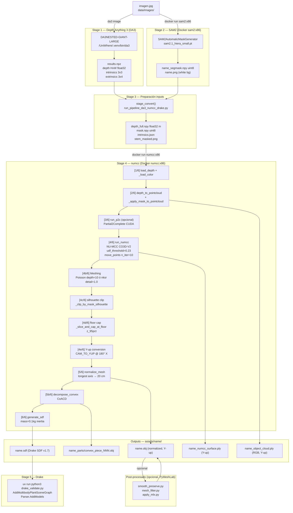

# Pipeline RGBD → OBJ: Documentación Técnica Completa

> **Audiencia:** Ingenieros nuevos al pipeline. Nivel: producción.
> **Objetivo:** Reproducir el pipeline completo desde cero sin documentación adicional.

---

## 1. Resumen Ejecutivo

### Objetivo del pipeline

Generar assets 3D (OBJ + SDF) listos para simulación robótica con Drake, a partir de:
- **Entrada monocular:** una imagen RGB → DA3 → profundidad métrica → segmentación → NU-MCC → mesh
- **Entrada RGBD real:** depth map + imagen de color (cámara de profundidad o simulación Drake) → NU-MCC → mesh

### Resultado final

| Artefacto | Formato | Uso |
|-----------|---------|-----|
| `<name>.obj` | Wavefront OBJ | Visualización, colisión Drake |
| `<name>.sdf` | Drake SDF v1.7 | Simulación física (masa, inercia, colisión convexa) |
| `<name>_parts/convex_piece_NNN.obj` | OBJ | Piezas CoACD para colisión |
| `<name>_numcc_surface.ply` | PLY binario | Nube de puntos NU-MCC (debug) |
| `<name>_object_cloud.ply` | PLY binario con RGB | Back-projection del depth con colores |

### Tecnologías utilizadas

| Componente | Tecnología | Repositorio |
|------------|-----------|-------------|
| Depth Estimation | Depth Anything 3 (DA3NESTED-GIANT-LARGE) | ByteDance |
| Segmentación | SAM2.1 small (Meta) | `cristian10gf/sam2` (fork) |
| Point Cloud Completion | P2C (Partial2Complete) | `CuiRuikai/Partial2Complete` |
| Surface Reconstruction | NU-MCC (CO3D-V2 checkpoint) | `sail-sg/numcc` |
| Meshing Neural | nksr (Neural Kernel Surface Reconstruction) | `nv-tlabs/nksr` |
| Meshing Clásico | Open3D Screened Poisson | `isl-org/Open3D` |
| Convex Decomposition | CoACD | `SarahWeiii/coacd` |
| Simulación | Drake | MIT CSAIL |
| Post-procesado | PyMeshLab | MeshLab |
| Runtime | Docker (numcc:x86, sam2:x86) | — |

### Flujo de alto nivel

```
imagen.jpg
    │
    ├──[DA3]────────────────→ depth_full.npy + intrinsics.json
    │
    ├──[SAM2]───────────────→ mask.npy + <stem>_masked.png
    │
    ├──[Preparación]────────→ numcc_input/ (depth + mask + color + intrínsecas)
    │
    ├──[P2C] (opcional)─────→ nube completada (fallback: depth cloud)
    │
    ├──[NU-MCC]─────────────→ surface_pts (nube de superficie)
    │
    ├──[Meshing]────────────→ mesh raw (Poisson o nksr)
    │
    ├──[Silhouette Clip]────→ mesh sin exceso lateral
    │
    ├──[Floor Cap]──────────→ mesh cerrado en plano de soporte
    │
    ├──[Normalización]──────→ longest axis = 20 cm
    │
    ├──[CoACD]─────────────→ partes convexas
    │
    ├──[SDF]───────────────→ <name>.sdf (Drake-ready)
    │
    └──[Drake]─────────────→ validación / visualización Meshcat
```

---

## 2. Arquitectura General

### Diagrama Mermaid end-to-end



### Componentes principales

| Componente | Tipo | Descripción |
|------------|------|-------------|
| `run_pipeline_da3_numcc_drake.py` | Orquestador Python | Encadena DA3→SAM2→convert→numcc→Drake con monitoreo VRAM |
| `run_numcc.py` | Wrapper Python | Interfaz simplificada al Docker numcc:x86 |
| `numcc/pipeline.py` | ENTRYPOINT Docker | Pipeline completo dentro del container |
| `numcc/pointcloud_utils.py` | Módulo | Carga depth, back-projection, conversión Y-up |
| `numcc/mesh_utils.py` | Módulo | Normalización mesh, CoACD |
| `numcc/sdf_generator.py` | Módulo | Generación SDF Drake |
| `numcc/remesh.py` | Script | Solo meshing desde PLY existente (salta NU-MCC) |
| `sam2/pipeline.py` | ENTRYPOINT Docker | Segmentación SAM2 |
| `tools/smooth_preserve.py` | Post-proceso | Suavizado preservando geometría |
| `tools/mesh_filter.py` | Post-proceso | Filtros individuales MeshLab |

---

## 3. Pipeline Completo Fase por Fase

---

### Fase 1 — Depth Anything 3 (DA3)

#### Propósito

Estimar un mapa de profundidad métrico en metros desde una imagen RGB monocular, junto con los parámetros intrínsecos de cámara estimados por el modelo.

#### Inputs

| Input | Tipo | Formato | Origen | Descripción |
|-------|------|---------|--------|-------------|
| `imagen.jpg` | Imagen RGB | JPEG/PNG | `data/images/` | Imagen del objeto a reconstruir |

#### Configuración

| Parámetro | Valor por defecto | Obligatorio | Descripción |
|-----------|------------------|-------------|-------------|
| `--export-format` | `npz` | Sí | Formato de salida: npz con depth + intrinsics |
| `--export-dir` | — | Sí | Directorio de salida |
| `--auto-cleanup` | flag | No | Elimina temporales después de exportar |
| `--conf-thresh-percentile` | 40.0 | No | Percentil de confianza para filtrar puntos (solo `glb`) |

#### Archivos utilizados

| Archivo | Ubicación | Función |
|---------|-----------|---------|
| `da3` CLI | `/home/worker-node-4/Documents/GitHub/UniWhere/.venv/bin/da3` | CLI de DA3 |
| `results.npz` | `data/outputs/pipeline/<name>/da3_raw/` | Salida del modelo |

#### Scripts ejecutados

| Script | Ruta | Función |
|--------|------|---------|
| `stage_da3()` | `tools/run_pipeline_da3_numcc_drake.py:107` | Llama a DA3 CLI y recoge el NPZ |

#### Comandos

```bash
# Activar venv donde está instalado DA3
source /home/worker-node-4/Documents/GitHub/UniWhere/.venv/bin/activate

# Depth map en formato NPZ (para pipeline numcc)
da3 image data/images/objeto.jpg \
    --export-format npz \
    --export-dir data/outputs/pipeline/objeto/da3_raw \
    --auto-cleanup

# Solo visualización
da3 image data/images/objeto.jpg \
    --export-format depth_vis \
    --export-dir data/outputs/depthmaps/objeto \
    --auto-cleanup
```

#### Procesamiento interno

DA3 (DA3NESTED-GIANT-LARGE-1.1) es un modelo transformer que estima:
1. **Depth métrico** en metros — NO relativo, NO necesita reescalado.
2. **Intrínsecos de cámara** — estimados desde el contenido de la imagen (focal length, centro óptico).
3. **Pose de cámara** — identidad para imagen única.

El modelo procesa la imagen a resolución reducida (ej. 504×378 para 1156×868 original). Los intrínsecos del NPZ corresponden a la resolución procesada, no a la imagen original.

**Decisión arquitectónica crítica:** NO renormalizar el depth a rangos arbitrarios ([0.1, 1.5]m). DA3NESTED-GIANT-LARGE produce depth métrico real. Renormalizar destruye la proporción Z/XY y distorsiona la nube de puntos. Solo hacer `np.clip(depth, 0.05, 20.0)`.

#### Outputs

| Output | Tipo | Formato | Destino |
|--------|------|---------|---------|
| `results.npz` | Array NumPy | NPZ | `data/outputs/pipeline/<name>/da3_raw/` |

**Claves del NPZ:**

| Clave | Shape | Dtype | Descripción |
|-------|-------|-------|-------------|
| `image` | `(N, H, W, 3)` | uint8 | Imagen procesada (resolución reducida) |
| `depth` | `(N, H, W)` | float32 | Depth métrico en metros |
| `conf` | `(N, H, W)` | float32 | Mapa de confianza |
| `intrinsics` | `(N, 3, 3)` | float32 | Matriz K estimada |
| `extrinsics` | `(N, 3, 4)` | float32 | Pose estimada (identidad para 1 imagen) |

#### Dependencias

- DA3 instalado en venv de UniWhere: `/home/worker-node-4/Documents/GitHub/UniWhere/.venv`
- Modelo `depth-anything/DA3NESTED-GIANT-LARGE-1.1` descargado automáticamente desde HuggingFace en el primer uso (~descarga automática).
- `numpy`, `PIL`, `torch`

#### Troubleshooting

| Problema | Síntoma | Causa | Solución |
|---------|---------|-------|----------|
| `da3: command not found` | Error al ejecutar | Venv no activado | `source /path/to/UniWhere/.venv/bin/activate` |
| NPZ sin clave `intrinsics` | KeyError | Versión antigua DA3 | Fallback en `stage_convert()`: usa 60° HFOV |
| Depth muy pequeño (mm) | Valores < 0.01 | Versión DA3 relativa | No aplica con DA3NESTED-GIANT-LARGE |
| `reference_view_strategy` KeyError | Crash en CLI | Bug en `cli.py` | Corregido en fork: `ref_view_strategy` (4 ocurrencias) |

---

### Fase 2 — SAM2 Segmentación

#### Propósito

Segmentar el objeto principal en la imagen RGB y generar: (a) imagen con fondo blanco, (b) máscara binaria `.npy` para filtrar la nube de puntos de profundidad.

#### Inputs

| Input | Tipo | Formato | Origen | Descripción |
|-------|------|---------|--------|-------------|
| `imagen.jpg` | Imagen RGB | JPEG/PNG | `data/images/` | Imagen original (misma que DA3) |
| `sam2.1_hiera_small.pt` | Checkpoint | PyTorch | `~/models/sam2/` | Pesos del modelo SAM2.1 small |

#### Configuración

| Parámetro | Valor por defecto | Obligatorio | Descripción |
|-----------|------------------|-------------|-------------|
| `--input` | — | Sí | Ruta imagen de entrada |
| `--output` | — | Sí | Directorio de salida |
| `--name` | — | Sí | Nombre del asset |
| `--device` | `cuda` | No | `cuda` o `cpu` |
| `--all-masks` | flag | No | Guarda todas las máscaras individuales |

#### Archivos utilizados

| Archivo | Ubicación | Función |
|---------|-----------|---------|
| `sam2/pipeline.py` | `sam2/pipeline.py` | Lógica de segmentación |
| `sam2.1_hiera_small.pt` | `~/models/sam2/` | Checkpoint del modelo |
| `configs/sam2.1/sam2.1_hiera_s.yaml` | Dentro del Docker | Configuración de arquitectura |

#### Scripts ejecutados

| Script | Ruta | Función |
|--------|------|---------|
| `stage_sam2()` | `tools/run_pipeline_da3_numcc_drake.py:133` | Lanza Docker SAM2 |
| `sam2/pipeline.py:main()` | `sam2/pipeline.py:98` | ENTRYPOINT del container |

#### Comandos

```bash
# Via pipeline completo (recomendado)
python3 tools/run_pipeline_da3_numcc_drake.py data/images/objeto.jpg --name objeto

# Via run_numcc.py (SAM2 automático si no se provee --mask)
python3 tools/run_numcc.py \
    --image data/images/objeto.jpg \
    --depth data/outputs/pipeline/objeto/numcc_input/depth_full.npy \
    --name objeto

# Docker directo
docker run --rm --gpus all \
    -v "$(pwd)/data/images":/input:ro \
    -v "$(pwd)/data/outputs":/output \
    -v "$HOME/models/sam2":/opt/sam2/checkpoints:ro \
    -v "$(pwd)/submodules/sam2/pipeline.py":/opt/sam2/pipeline.py:ro \
    --entrypoint python3 \
    sam2:x86 /opt/sam2/pipeline.py \
    --input /input/objeto.jpg \
    --output /output \
    --name objeto
```

#### Procesamiento interno

1. Carga imagen como numpy `(H, W, 3)` uint8.
2. `SAM2AutomaticMaskGenerator(sam2)` — genera todas las máscaras sin prompts (modo automático).
3. `most_centered_mask()` — selecciona la máscara cuyo centroide está más cerca del centro de la imagen (heurística para objeto principal).
4. `save_isolated()` — recorta el objeto (bbox + 20px padding), aplica fondo blanco, guarda PNG.
5. Guarda la máscara binaria full-size como `{name}_segmask.npy` uint8 (1 = objeto).

**Selección de modelo:** SAM2.1 small (`sam2.1_hiera_small.pt`, 176 MB). Detecta objetos enteros sin fragmentarlos. Comparativa tiny/small/base_plus: small es el punto óptimo (~2.4 GB VRAM, ~2.4s).

#### Outputs

| Output | Tipo | Formato | Destino |
|--------|------|---------|---------|
| `<name>_viz.png` | Imagen | PNG | `data/outputs/` |
| `<name>.png` | Imagen RGB | PNG (fondo blanco) | `data/outputs/` |
| `<name>_segmask.npy` | Máscara binaria | NPY uint8 `(H, W)` | `data/outputs/` |
| `<name>_mask{N}.png` | Máscaras | PNG (con `--all-masks`) | `data/outputs/` |

#### Dependencias

- Docker imagen `sam2:x86` (o `sam2:jetson` en Jetson)
- Checkpoint en `~/models/sam2/sam2.1_hiera_small.pt`
- GPU con `--gpus all` (x86) o `--runtime=nvidia` (Jetson)

#### Troubleshooting

| Problema | Síntoma | Causa | Solución |
|---------|---------|-------|----------|
| Objeto fragmentado en múltiples máscaras | Máscara incorrecta | Fondo complejo | Ajustar `SAM2AutomaticMaskGenerator` params o usar base_plus |
| `sam2._C` no compilado | Warning en logs | CUDA ext no compiló en imagen x86 | Funcional igual, solo sin post-processing de huecos |
| Checkpoint no encontrado | FileNotFoundError | `~/models/sam2/` vacío | Ejecutar `cd submodules/sam2/checkpoints && bash download_ckpts.sh` |
| GPU OOM | CUDA out of memory | Imagen muy grande | Redimensionar imagen antes |

---

### Fase 3 — Preparación de Inputs numcc

#### Propósito

Convertir los outputs de DA3 (NPZ) y SAM2 (máscara) en el formato exacto que espera el container numcc: depth métrico en metros, máscara a resolución del depth, intrínsecos en JSON, imagen de color con fondo blanco.

#### Inputs

| Input | Tipo | Formato | Origen | Descripción |
|-------|------|---------|--------|-------------|
| `results.npz` | NumPy | NPZ | DA3 output | Depth + intrinsics |
| `<name>_segmask.npy` | Máscara | NPY uint8 | SAM2 output | Máscara objeto |
| `imagen.jpg` | Imagen | JPEG/PNG | `data/images/` | Imagen original |

#### Archivos utilizados

| Archivo | Ubicación | Función |
|---------|-----------|---------|
| `stage_convert()` | `tools/run_pipeline_da3_numcc_drake.py:172` | Genera todos los inputs numcc |

#### Comandos

```bash
# Stage 3 se ejecuta automáticamente dentro de run_pipeline_da3_numcc_drake.py
# No hay comando standalone — forma parte del pipeline orquestado
```

#### Procesamiento interno

```python
# Depth: extraer del NPZ y clipear
depth = data["depth"][0].astype(np.float32)
depth_full = np.clip(depth, 0.05, 20.0)          # NO renormalizar
np.save(work_dir / "depth_full.npy", depth_full)

# Máscara: resize a resolución del depth (NEAREST para preservar bordes)
m_img = PILImage.fromarray(mask_orig * 255).resize((W, H), PILImage.NEAREST)
mask_depth_res = (np.asarray(m_img) > 0).astype(np.uint8)
np.save(work_dir / "mask.npy", mask_depth_res)

# Intrínsecos: extraer de NPZ o fallback a 60° HFOV
K = data["intrinsics"][0]
intri_out.write_text(json.dumps({"fx": K[0,0], "fy": K[1,1], "cx": K[0,2], "cy": K[1,2]}))

# Color masked: imagen original con fondo blanco fuera del objeto
color_masked[~color_mask] = 255
PILImage.fromarray(color_masked).save(work_dir / f"{stem}_masked.png")
```

**Decisión sobre la máscara de color:** la máscara SAM2 está en la resolución de la imagen original, pero el depth de DA3 está en resolución reducida. El resize usa `NEAREST` para mantener bordes nítidos (no interpolar valores binarios).

**Decisión sobre depth_full:** se pasa el depth COMPLETO (sin máscarar) a numcc. Dentro del container, numcc aplica la máscara para filtrar puntos del objeto. Esto permite que `seen_xyz` incluya contexto de escena mientras la nube de puntos queda filtrada al objeto.

#### Outputs

| Output | Tipo | Formato | Destino |
|--------|------|---------|---------|
| `depth_full.npy` | Depth métrico | NPY float32 `(H, W)` metros | `data/outputs/pipeline/<name>/numcc_input/` |
| `mask.npy` | Máscara objeto | NPY uint8 `(H, W)` | `data/outputs/pipeline/<name>/numcc_input/` |
| `intrinsics.json` | Intrínsecos | JSON `{fx, fy, cx, cy}` | `data/outputs/pipeline/<name>/numcc_input/` |
| `<stem>_masked.png` | Color masked | PNG RGB | `data/outputs/pipeline/<name>/numcc_input/` |
| `depth_vis.png` | Visualización | PNG | `data/outputs/pipeline/<name>/numcc_input/` |

#### Troubleshooting

| Problema | Síntoma | Causa | Solución |
|---------|---------|-------|----------|
| Depth fuera de escala (mm) | Valores 300-850 en vez de 0.3-0.85 | NPZ de DA3 en mm | No aplica con DA3NESTED-GIANT-LARGE (produce metros) |
| Máscara sin superposición con depth | 0 object pts tras mask-filter | Resoluciones incompatibles | El resize NEAREST lo resuelve automáticamente |
| `intrinsics` no en NPZ | KeyError | DA3 versión antigua | Fallback activo: usa 60° HFOV |

---

### Fase 4 — numcc Pipeline (NU-MCC)

Esta es la fase central. Se ejecuta **dentro del Docker container `numcc:x86`** via `numcc/pipeline.py` (ENTRYPOINT).

---

#### Fase 4.1 — Carga depth + color

**Propósito:** Cargar el depth map y la imagen de color en los formatos internos del pipeline.

| Input | Tipo | Formato | Descripción |
|-------|------|---------|-------------|
| `depth_full.npy` | NPY | float32 `(H, W)` metros | Mapa de profundidad métrico |
| `<stem>_masked.png` | PNG | RGB uint8 | Imagen con fondo blanco |

```python
# pointcloud_utils.py:load_depth()
depth = np.load(path).astype(np.float32)        # .npy → metros directo
# ó
depth = imageio.imread(path).astype(float32) / 1000.0  # .png uint16 mm → metros

# pipeline.py:_load_color()
color = imageio.imread(color_path)               # PNG → (H, W, 3) uint8
# Si RGBA: se usa solo los 3 primeros canales dentro de run_numcc()
```

---

#### Fase 4.2 — Back-projection + filtro por máscara

**Propósito:** Convertir el depth map 2D a nube de puntos 3D (back-projection pinhole), luego filtrar por la máscara SAM2 para aislar el objeto.

**Modelo de cámara pinhole:**

```
X = (u - cx) * Z / fx
Y = (v - cy) * Z / fy
Z = depth[v, u]
```

El sistema de coordenadas es OpenCV: +X derecha, +Y abajo, +Z hacia la escena.

```python
# pointcloud_utils.py:depth_to_pointcloud()
v_idx, u_idx = np.where(depth > 0)
Z = depth[v_idx, u_idx]
X = (u_idx - cx) * Z / fx
Y = (v_idx - cy) * Z / fy
all_pts = np.stack([X, Y, Z], axis=1)   # (N, 3) camera frame

# Filtro por máscara
object_pts = all_pts[mask[v_idx, u_idx]]

# Guardar PLY en Y-up (para viewers/Drake)
_save_ply(ply_path, to_y_up(object_pts), object_colors)
```

**Conversión de frame:** `CAM_TO_YUP` rota 180° alrededor del eje X (flip Y y Z): `(x, y, z) → (x, -y, -z)`. Convierte de OpenCV (Y-abajo, Z-hacia-escena) a Y-up (estándar para viewers y Drake). Se aplica **solo al guardar** archivos; el procesamiento interno de NU-MCC, silhouette clip y floor cap se hace en el frame de cámara original.

**Outputs de esta sub-fase:**
- `<name>_object_cloud.ply` — nube filtrada con colores RGB en Y-up
- `object_pts` — nube en camera frame para pasar a NU-MCC

---

#### Fase 4.3 — P2C Point Cloud Completion (opcional)

**Propósito:** Completar zonas ocluidas de la nube de puntos usando P2C (Partial2Complete), un transformer que completa nubes parciales.

> **Nota importante:** El checkpoint `p2c_checkpoint.pth` es un ZIP con pesos por categoría ShapeNet (plane/car/chair/lamp/sofa/table/watercraft/cabinet), **no** el modelo P2C de CuiRuikai. Si `load_state_dict` falla por mismatch de arquitectura, el pipeline continúa graciosamente con la nube de depth sin completar.

```python
# Configuración P2C (defaults del paper)
config = EasyDict({
    "num_group": 128, "group_size": 32,
    "mask_ratio": [48, 48, 32],    # suma = num_group
    "feat_dim": 1024, "n_points": 2048,
    ...
})
model = P2C(config)
completed = model(pts_t)  # (1, M, 3) directo, sin dict wrapper
```

El pipeline usa `--no-p2c` por defecto en `run_pipeline_da3_numcc_drake.py` porque el checkpoint actual tiene mismatch de arquitectura. La nube de depth cruda es suficiente para NU-MCC.

**Salida:** `<name>_pointcloud.npy` — nube P2C en Y-up (si P2C funcionó)

---

#### Fase 4.4 — NU-MCC Surface Reconstruction

**Propósito:** Reconstruir la superficie 3D del objeto usando el modelo NU-MCC (Multiview Compressive Coding) entrenado en CO3D-V2.

**LIMITACIÓN FUNDAMENTAL:** NU-MCC es un densificador/completador multiview, **no** un generador 360° monocular. Desde una sola imagen solo densifica y limpia la superficie visible; no alucina la parte trasera.

| Entrada NU-MCC | Shape | Tipo | Descripción |
|----------------|-------|------|-------------|
| `seen_images` | `(1, 3, 800, 800)` | float32 CUDA | Imagen recortada al bbox del objeto, resize 800×800 |
| `seen_xyz` | `(1, 112, 112, 3)` | float32 CUDA | Mapa XYZ normalizado, `inf` donde depth=0 |
| `valid_seen_xyz` | `(1, 112, 112)` | bool CUDA | True donde depth > 0 y está en la máscara |
| `query_xyz` | `(1, Q, 3)` | float32 CUDA | Grid 3D de puntos a evaluar el UDF |

**Parámetros del checkpoint CO3D-V2 (`udf-ep99.pth`):**

| Parámetro | Valor | Descripción |
|-----------|-------|-------------|
| `n_groups` | 200 | Shape de init_embedding en checkpoint |
| `nneigh` | 4 | Vecinos de anclaje que el decoder atiende (training default) |
| `nn_seen` | 4 | Vecinos seen_xyz por query point (training default) |
| `udf_threshold` | 0.23 | Threshold training CO3D-V2 (candidatos bajo este UDF) |
| `udf_n_iter` | 10 | Iteraciones move_points (gradient descent sobre UDF) |
| `repulsive` | 1 | Fuerzas repulsivas en move_points (training default) |
| `xyz_size` | 112 | Resolución del mapa XYZ (hardcoded, coincide con checkpoint) |

**Flujo interno de run_numcc():**

```
1. Back-project depth COMPLETO → mapa XYZ full-resolution (H,W,3)
2. Aplicar máscara SAM2 → NaN en píxeles de fondo
3. Normalización: center = mean(valid_pts), scale = mean(std_per_axis)
   - Solo sobre píxeles de objeto (con máscara aplicada)
   - Coincide con demo_iphone.py normalize()
4. Crop al bbox del objeto (+40px margin) → pad cuadrado → resize 112×112
   (Mismo bbox para seen_xyz Y seen_images — alineación espacial)
5. seen_images: mismo crop en imagen de color → pad negro → resize 800×800
6. Encoder: preprocess_img(seen_images) → downscale a 224
   model.encoder(seen_images_proc, seen_xyz_shrunk, valid_seen) → latent
7. Decoder L1: model.decoderl1(latent) → fea + anchors_xyz (200 centros)
8. Query grid: basado en anchor bbox ± 0.3 + depth bbox ± 0.3 (unión)
   n_side = cbrt(n_query) = 58 para n_query=200000
9. Decoder L2 en batches de 6000: model.decoderl2(q_batch, ...) → UDF
   Candidatos: q donde UDF < 0.23
10. move_points: gradient descent sobre UDF, n_iter=10
    x ← x - ∇UDF * UDF(x)   (snap candidatos a zero-level set)
11. Return surface_pts (normalizado), norm_center, norm_scale
```

**Decisión sobre crop+zoom (vs resize frame completo):**
Hacer resize de todo el frame a 112×112 deja el objeto en un parche tiny en una esquina — fuera de distribución para NU-MCC. El crop+zoom hace que el objeto llene los 112×112 píxeles, que es la distribución de entrenamiento CO3D-V2.

---

#### Fase 4.5 — Meshing

**Propósito:** Convertir la nube de puntos de superficie de NU-MCC a mesh poligonal (caras triangulares).

Dos métodos disponibles:

**Método Poisson (`_points_to_mesh()`):**
```python
pcd.estimate_normals(KDTreeSearchParamHybrid(radius=r, max_nn=50))
pcd.orient_normals_consistent_tangent_plane(30)
mesh, densities = o3d.geometry.TriangleMesh.create_from_point_cloud_poisson(pcd, depth=10)
# Remove bottom 2% density vertices (boundary artifacts)
threshold = np.quantile(densities, 0.02)
mesh.remove_vertices_by_mask(densities < threshold)
```

**Método nksr (`_points_to_mesh_noksr()`):**
```python
reconstructor = nksr.Reconstructor(device)
field = reconstructor.reconstruct(pts_t, normal=normals_t, detail_level=1.0)
mesh_nksr = field.extract_dual_mesh(mise_iter=1)
# Fallback si nksr no disponible: BPA (Ball-Pivoting Algorithm)
```

| Método | Faces típicas | VRAM | Tiempo | CoACD parts | Cuándo usar |
|--------|--------------|------|--------|-------------|-------------|
| `poisson` | ~140K | menor | ~45-60s total | menos | Objetos convexos, mayor velocidad |
| `noksr` | ~260K | mayor | ~70-100s total | más | Mejor en zonas dispersas/complejas |

---

#### Fase 4.6 — Silhouette Clip

**Propósito:** Eliminar caras del mesh que proyectan fuera de la silueta SAM2 cuando se ve desde la cámara. Evita exceso lateral en zonas de baja confianza NU-MCC.

```python
# _clip_by_mask_silhouette()
# Proyectar vértices de vuelta a píxeles de la cámara
verts_m = mesh.vertices * norm_scale + norm_center  # des-normalizar
u = fx * X / Z + cx
v = fy * Y / Z + cy
# Dilatar máscara 15px para no sobre-recortar en el borde
mask_bin = binary_dilation(mask_bin, structure=struct_15px)
# Mantener cara si AL MENOS UN vértice está dentro de la máscara
keep = in_mask[mesh.faces].any(axis=1)
```

Con `dilation_px=0` (valor actual en el pipeline) no hay dilatación — recorte estricto al borde del objeto.

---

#### Fase 4.7 — Floor Cap

**Propósito:** Cuando el objeto está sobre una superficie de soporte (ej. bin en AIRA), cortar el mesh en el plano de soporte y cerrar la base con un polígono que sigue el contorno real del objeto.

Solo se ejecuta si se provee `--mask`. El plano de corte es el percentil 95 del depth del objeto (en el sistema de la cámara donde Z grande = lejos = superficie de soporte).

```python
z_floor = np.percentile(object_pts[:, 2], 95)    # metros, camera frame
z_floor_norm = (z_floor - norm_center[2]) / norm_scale  # normalized

# slice_mesh_plane: corta el mesh en z=z_floor_norm
mesh_cut = trimesh.intersections.slice_mesh_plane(mesh, [0,0,-1], [0,0,z_floor_norm])

# Triangulación de la tapa: shapely + scipy.interpolate.griddata
# La tapa sigue el contorno real (Z interpolado desde boundary), no es un plano flat
```

---

#### Fase 4.8 — Conversión Y-up

**Propósito:** Rotar el mesh del sistema OpenCV (Y-abajo, Z-hacia-escena) al sistema Y-up estándar para viewers y Drake.

```python
CAM_TO_YUP = [[1, 0, 0], [0, -1, 0], [0, 0, -1]]   # 180° alrededor de X
T_yup = np.eye(4)
T_yup[:3, :3] = CAM_TO_YUP
mesh.apply_transform(T_yup)
```

---

#### Fase 4.9 — Normalización y Exportación OBJ

**Propósito:** Escalar el mesh para que su eje más largo mida exactamente 20 cm (0.20 m), centrar en origen, exportar OBJ.

```python
# mesh_utils.py:normalize_mesh()
mesh.apply_translation(-mesh.centroid)
scale = 0.20 / mesh.extents.max()
mesh.apply_scale(scale)
mesh.export(str(obj_path))
```

El factor 0.20 m es consistente con todos los assets existentes en AIRA para compatibilidad con la simulación Drake.

---

#### Fase 4.10 — Convex Decomposition (CoACD)

**Propósito:** Descomponer el mesh en partes convexas para colisión física eficiente en Drake.

```python
# mesh_utils.py:decompose_convex()
m = coacd.Mesh(vertices, faces)
parts = coacd.run_coacd(m)
for i, (v, f) in enumerate(parts):
    trimesh.Trimesh(v, f).export(parts_dir / f"convex_piece_{i:03d}.obj")
```

**Número de partes por tipo de objeto:**

| Tipo | Partes CoACD | Causa |
|------|-------------|-------|
| Objeto convexo (lapicero) | ~7 | Mesh cerrado y convexo |
| Objeto cóncavo (taza, DA3 mono) | 200-333 | Cáscara abierta desde monocular |
| Objeto RGBD real (Drake) | ~20-50 | Densificación correcta NU-MCC |

---

#### Fase 4.11 — Generación SDF Drake

**Propósito:** Generar un archivo SDF v1.7 compatible con Drake que incluye: masa, inercia, visual (OBJ), colisión (CoACD parts), propiedades de proximidad hidroelástica.

```xml
<!-- sdf_generator.py — estructura generada -->
<sdf xmlns:drake="drake.mit.edu" version="1.7">
  <model name="{name}">
    <link name="{name}_body_link">
      <inertial>
        <mass>0.1</mass>  <!-- kg, constante para todos los assets -->
        <pose>{com_x} {com_y} {com_z} 0 0 0</pose>
        <inertia>...</inertia>
      </inertial>
      <visual name="visual">
        <geometry><mesh><uri>{name}.obj</uri></mesh></geometry>
      </visual>
      <collision name="collision_000">
        <geometry>
          <mesh>
            <uri>{name}_parts/convex_piece_000.obj</uri>
            <drake:declare_convex/>
          </mesh>
        </geometry>
        <drake:proximity_properties>
          <drake:rigid_hydroelastic/>
          <drake:mu_dynamic>1.000</drake:mu_dynamic>
        </drake:proximity_properties>
      </collision>
      <!-- ... más collisions para cada CoACD part ... -->
    </link>
  </model>
</sdf>
```

**Cálculo de inercia:** trimesh calcula CoM e inercia asumiendo masa = 0.1 kg y densidad = masa/volumen del mesh.

#### Outputs finales de Fase 4

| Output | Tipo | Formato | Destino |
|--------|------|---------|---------|
| `<name>.obj` | Mesh OBJ | Wavefront OBJ | `assets/<name>/` |
| `<name>.sdf` | SDF Drake | XML | `assets/<name>/` |
| `<name>_object_cloud.ply` | Nube de puntos RGB | PLY binario | `assets/<name>/` |
| `<name>_numcc_surface.ply` | Nube de superficie | PLY binario | `assets/<name>/` |
| `<name>_pointcloud.npy` | Nube P2C | NPY float32 | `assets/<name>/` (si P2C corrió) |
| `<name>_parts/convex_piece_NNN.obj` | CoACD parts | Wavefront OBJ | `assets/<name>/<name>_parts/` |

#### Troubleshooting numcc

| Problema | Síntoma | Causa | Solución |
|---------|---------|-------|----------|
| `No UDF candidates below threshold` | 0 surface pts | UDF threshold muy bajo | Subir `--udf-threshold` (default 0.23, probar 0.30) |
| OOM CUDA | CUDA out of memory | `nn_seen=-1` o n_query muy grande | Verificar `nn_seen=4`, reducir `--n-query` |
| Mesh vacío / muy escaso | OBJ sin caras | `move_points` saltado | Verificar `--udf-n-iter` ≥ 3 |
| `RuntimeError: No valid object pixels for seen_xyz` | Crash pipeline | Máscara y depth desalineados | Verificar resize de máscara a resolución depth |
| CoACD 200+ partes | SDF fragmentado | Cáscara abierta (monocular DA3 + cóncavo) | Usar TRELLIS/TripoSR para ese objeto |
| nksr no disponible | Fallback a BPA | Build falló o stub PyPI | Rebuildar Docker, verificar `nksr.Reconstructor` |
| Floor cap falla | Exception en slice_mesh_plane | Mesh no watertight antes del corte | Usar `--no-floor-cap` |

---

### Fase 5 — Drake Validation

#### Propósito

Validar que el SDF generado sea parseable por Drake (carga correcta del modelo, conteo de bodies/frames). Opcionalmente visualizar en Meshcat.

#### Inputs

| Input | Tipo | Formato | Descripción |
|-------|------|---------|-------------|
| `<name>.sdf` | SDF | XML | Asset generado por numcc |

#### Scripts ejecutados

| Script | Ruta | Función |
|--------|------|---------|
| `stage_drake()` | `tools/run_pipeline_da3_numcc_drake.py:392` | Ejecuta validación o Meshcat |
| `_DRAKE_VALIDATE` | Inline en script | Python inline: Parser.AddModels + Finalize |
| `_DRAKE_MESHCAT` | Inline en script | Python inline: StartMeshcat + visualización |

#### Comandos

```bash
# Validación rápida (no interactiva)
python3 tools/run_pipeline_da3_numcc_drake.py data/images/objeto.jpg --name objeto

# Visualización Meshcat (bloquea hasta Ctrl+C)
python3 tools/run_pipeline_da3_numcc_drake.py data/images/objeto.jpg --name objeto \
    --drake-interactive
```

#### Procesamiento interno

```python
# Validación Drake (se ejecuta con: uv run python3 script.py sdf_path)
from pydrake.all import AddMultibodyPlantSceneGraph, DiagramBuilder, Parser
builder = DiagramBuilder()
plant, _ = AddMultibodyPlantSceneGraph(builder, time_step=0.001)
Parser(plant).AddModels(sdf_path)
plant.Finalize()
# OK si no lanza excepción
```

#### Troubleshooting

| Problema | Síntoma | Causa | Solución |
|---------|---------|-------|----------|
| `uv: command not found` | Error al lanzar Drake | uv no instalado | `curl -LsSf https://astral.sh/uv/install.sh \| sh` |
| Drake no en pyproject.toml | ImportError | Entorno equivocado | Usar `uv run` desde la raíz del proyecto (con `pyproject.toml`) |
| `SDF parse error` | Drake falla al cargar | URI de CoACD parts incorrecto | Verificar rutas relativas en SDF vs ubicación OBJ |
| Bodies: 1, Frames: 2 | Normal | Solo un link en el modelo | Correcto |

---

### Fase 6 — Post-procesado de Mesh (Opcional)

#### Propósito

Mejorar calidad del mesh OBJ: eliminar grumos, suavizar superficies, preservar aristas geométricas.

#### Scripts disponibles

| Script | Ruta | Cuándo usar |
|--------|------|-------------|
| `smooth_preserve.py` | `tools/smooth_preserve.py` | Suavizado completo con preservación de bordes |
| `mesh_filter.py` | `tools/mesh_filter.py` | Filtros individuales selectivos |
| `apply_mlx.py` | `tools/apply_mlx.py` | Aplicar script `.mlx` exportado desde MeshLab GUI |

#### Comandos

```bash
# Prerequisito: asegurar permisos (assets Docker son de root)
sudo chown -R $USER:$USER assets/

# smooth_preserve.py — secuencia recomendada
.venv/bin/python3 tools/smooth_preserve.py assets/objeto/objeto/objeto.obj assets/objeto/objeto/objeto_smooth.obj

# Con parámetros personalizados
.venv/bin/python3 tools/smooth_preserve.py input.obj output.obj \
    --cluster-threshold 0.3 \
    --taubin-iter 20 \
    --twosteps-iter 5 \
    --feature-angle 30

# mesh_filter.py — filtros individuales
.venv/bin/python3 tools/mesh_filter.py input.obj output.obj \
    --smooth-normals --smooth-iter 4 \
    --depth-smooth --depth-smooth-iter 4 \
    --cluster-decimation --threshold 0.3

# apply_mlx.py — script MeshLab exportado
.venv/bin/python3 tools/apply_mlx.py input.obj output.obj assets/Scripts/script_smooth_preserve.mlx
```

#### Procesamiento interno smooth_preserve.py

```
1. Clustering Decimation (threshold=0.3% bbox) — reduce face count primero
2. Remove unreferenced vertices
3. Taubin Smooth (iter=10) — suaviza sin encoger mesh (mejor que Laplacian)
4. Two Steps Smoothing (iter=3, angle=60°) — alisa zonas planas, preserva aristas
5. Smooth Face Normals — limpia normales al final
```

**Scripts MLX guardados en `assets/Scripts/`:**
- `script_smoothing.mlx` — smooth normals + clustering + depth smooth
- `script_smooth_preserve.mlx` — clustering + Taubin + Two Steps (recomendado)

---

## 4. Trazabilidad Completa de Datos

| Etapa | Input | Transformación | Output | Ubicación |
|-------|-------|---------------|--------|-----------|
| DA3 | `imagen.jpg` | Monocular depth estimation (transformer) | `results.npz` | `data/outputs/pipeline/<name>/da3_raw/` |
| SAM2 | `imagen.jpg` | Segmentación automática SAM2.1 small | `<name>_segmask.npy`, `<name>.png` | `data/outputs/` |
| Preparación | `results.npz` + `<name>_segmask.npy` | Clip depth, resize mask, extraer intrínsecas | `depth_full.npy`, `mask.npy`, `intrinsics.json`, `<stem>_masked.png` | `data/outputs/pipeline/<name>/numcc_input/` |
| Load depth | `depth_full.npy` | `np.load().astype(float32)` | `depth (H,W) float32 metros` | memoria |
| Back-projection | `depth (H,W)`, `fx,fy,cx,cy` | Pinhole model: `X=(u-cx)*Z/fx` | `all_pts (N,3) camera frame` | memoria |
| Mask filter | `all_pts`, `mask.npy` | Boolean index con resize NEAREST | `object_pts (M,3)`, `object_colors (M,3)` | memoria |
| Save cloud | `object_pts` | `to_y_up()` + `_save_ply()` | `<name>_object_cloud.ply` | `assets/<name>/` |
| Subsample | `object_pts` | Random subsample a n=2048 | `partial_pts (2048,3)` | memoria |
| P2C (opt.) | `partial_pts (2048,3)` | P2C transformer CUDA → 2048 pts | `completed_pts (2048,3)` | memoria + `<name>_pointcloud.npy` |
| XYZ map full | `depth (H,W)`, `intrinsics` | Pinhole a full res → NaN mask | `xyz_full (H,W,3)` | memoria |
| Normalización | `xyz_full[valid]` | `center=mean, scale=mean(std_per_axis)` | `xyz_full normalizado`, `norm_center, norm_scale` | memoria |
| Crop+zoom | `xyz_full normalizado` | Bbox+40px → pad cuadrado → resize 112 | `seen_xyz (112,112,3)` | memoria |
| seen_images | `<stem>_masked.png` | Mismo crop → pad negro → resize 800 | `seen_images (1,3,800,800)` | memoria CUDA |
| Encode | `seen_images`, `seen_xyz` | `preprocess_img(seen_images)` → encode | `latent`, `anchors_xyz (1,200,3)` | memoria CUDA |
| Query grid | `anchors_xyz`, `depth bbox` | Unión anchors ± 0.3 con depth bbox | `grid (200K,3)` | memoria CUDA |
| UDF eval | `grid`, `latent` | Decoder L2 en batches de 6000 | `all_udf (200K,)`, `candidates` | memoria |
| move_points | `candidates`, `model` | Grad descent n_iter=10: `x - ∇UDF*UDF(x)` | `surface_pts (K,3) normalizado` | memoria |
| Save surface | `surface_pts` | `to_y_up()` + `_save_ply()` | `<name>_numcc_surface.ply` | `assets/<name>/` |
| Poisson/nksr | `surface_pts (K,3)` | Surface recon: Poisson depth=10 ó nksr | `raw_mesh` (camera frame) | memoria |
| Silhouette clip | `raw_mesh`, `mask.npy` | Project verts → píxeles, keep if in mask | `mesh` recortado | memoria |
| Floor cap | `mesh` | Slice en z_95pct + triangular tapa | `mesh` cerrado | memoria |
| Y-up | `mesh` (camera frame) | `CAM_TO_YUP` @ 180° X | `mesh` (Y-up) | memoria |
| Normalización | `mesh` | `center=-centroid, scale=0.20/extents.max` | `mesh` 20cm max axis | memoria |
| Export OBJ | `mesh` | trimesh.export | `<name>.obj` | `assets/<name>/` |
| CoACD | `mesh` | `coacd.run_coacd()` | `convex_piece_NNN.obj` × N | `assets/<name>/<name>_parts/` |
| SDF | `mesh`, `parts` | Calcular inercia + generar XML Drake | `<name>.sdf` | `assets/<name>/` |
| Drake | `<name>.sdf` | `Parser.AddModels()` + `Finalize()` | Validación OK | — |

---

## 5. Modelos de IA Utilizados

### 5.1 DA3NESTED-GIANT-LARGE-1.1 (Depth Anything 3)

| Campo | Valor |
|-------|-------|
| Nombre | DA3NESTED-GIANT-LARGE-1.1 |
| Arquitectura | Transformer encoder-decoder nested (ByteDance, 2025) |
| Checkpoint | Auto-descarga HuggingFace: `depth-anything/DA3NESTED-GIANT-LARGE-1.1` |
| Ubicación local | `~/.cache/huggingface/` (caché HF) |
| Inputs | Imagen RGB cualquier resolución |
| Outputs | depth (H,W) float32 metros, intrinsics (3,3), extrinsics (3,4) |
| Requiere GPU | Sí (recomendado), ~9 GB VRAM |
| Tiempo inferencia | ~10s (RTX 4000 Ada) |
| Instalación | Venv UniWhere: `source /path/to/UniWhere/.venv/bin/activate` |

### 5.2 SAM2.1 small (Meta)

| Campo | Valor |
|-------|-------|
| Nombre | SAM2.1 Hiera Small |
| Arquitectura | Hierarchical vision transformer (SAM2, Meta 2024) |
| Checkpoint | `sam2.1_hiera_small.pt` (176 MB) |
| Ubicación | `~/models/sam2/sam2.1_hiera_small.pt` |
| Config | `configs/sam2.1/sam2.1_hiera_s.yaml` (dentro del Docker) |
| Inputs | Imagen RGB numpy `(H, W, 3)` uint8 |
| Outputs | Lista de máscaras con bbox, area, segmentation |
| Requiere GPU | Sí, ~2.4 GB VRAM |
| Tiempo inferencia | ~2.4s (RTX 4000 Ada) |
| Docker | `sam2:x86` |

### 5.3 P2C (Partial2Complete)

| Campo | Valor |
|-------|-------|
| Nombre | P2C — Partial2Complete |
| Arquitectura | Transformer + chamfer_dist + pointops CUDA |
| Checkpoint | `p2c_checkpoint.pth` (1.9 GB, Google Drive) |
| Ubicación | `~/models/numcc/p2c/p2c_checkpoint.pth` |
| Inputs | `(1, N, 3)` float32 CUDA — nube parcial |
| Outputs | `(1, 2048, 3)` float32 — nube completada |
| Estado | Fallback gracioso si mismatch de arquitectura |
| Requiere GPU | Sí |

### 5.4 NU-MCC (Multiview Compressive Coding, CO3D-V2)

| Campo | Valor |
|-------|-------|
| Nombre | NU-MCC (NUMCC) |
| Arquitectura | Encoder: ViT + XYZPosEmbed. Decoder: cross-attention sobre 200 anchors. Campo UDF implícito. |
| Checkpoint | `udf-ep99.pth` (2.4 GB, AWS S3) |
| Ubicación | `~/models/numcc/numcc/numcc_checkpoint.pth` |
| Inputs | `seen_images (1,3,800,800)`, `seen_xyz (1,112,112,3)`, `query_xyz (1,Q,3)` |
| Outputs | Campo UDF por query point. Candidatos refinados con move_points → surface_pts |
| n_groups | 200 (coincide con shape en checkpoint) |
| nneigh | 4 (training default CO3D-V2) |
| nn_seen | 4 (training default) |
| udf_threshold | 0.23 (training default) |
| Requiere GPU | Sí, ~9.4 GB VRAM pico |
| Tiempo inferencia | ~40-60s (RTX 4000 Ada) |
| Docker | `numcc:x86` |
| LIMITACIÓN | Solo densifica superficie visible. No genera parte trasera desde una imagen. |

### 5.5 nksr (Neural Kernel Surface Reconstruction)

| Campo | Valor |
|-------|-------|
| Nombre | nksr |
| Arquitectura | Kernel implicito neuronal sobre GPU (CUDA) |
| Checkpoint | `ks.pth` (~55 MB, HuggingFace auto-descarga) |
| Ubicación | `~/models/nksr_cache/torch/hub/checkpoints/ks.pth` |
| Inputs | `pts_t (N,3)`, `normals_t (N,3)` float32 CUDA |
| Outputs | Dual mesh (verts, faces) |
| Requiere GPU | Sí |
| Tiempo | ~15-20s solo (parte del pipeline nksr total ~70-100s) |
| Build | Desde `submodules/nksr/package/` con `--no-build-isolation` |
| Nota | Wheel server `nksr.huangjh.tech` caído (NXDOMAIN). Solo vía submodulo. |

---

## 6. Configuración Completa del Entorno

### Requisitos Hardware

| Componente | Mínimo | Recomendado (testado) |
|-----------|--------|----------------------|
| GPU | 8 GB VRAM CUDA | RTX 4000 Ada (20 GB) |
| RAM | 16 GB | 32 GB |
| Disco | 20 GB libres | 50 GB |
| CPU | x86-64 | x86-64 (pipeline numcc es solo x86) |

**Nota Jetson:** numcc usa `Dockerfile.x86` con imágenes CUDA devel; no hay imagen ARM64 para numcc. DA3 y SAM2 sí tienen soporte Jetson.

### Requisitos Software

| Software | Versión | Propósito |
|---------|---------|-----------|
| Ubuntu / Linux | 20.04+ | SO base |
| Docker | 24.0+ | Contenedores numcc, sam2 |
| NVIDIA Container Toolkit | latest | `--gpus all` en Docker |
| CUDA (host) | 11.8+ | GPU access para Docker |
| Python | 3.12 | Orquestadores y tools |
| uv | latest | Gestión de entorno (Drake) |
| PyMeshLab | latest | Post-procesado (vía `.venv`) |

### Variables de entorno relevantes

| Variable | Valor | Dónde | Descripción |
|---------|-------|-------|-------------|
| `TORCH_CUDA_ARCH_LIST` | `"7.5;8.0;8.6;8.9"` | Dockerfile.x86 | Arquitecturas GPU para compilar extensiones CUDA |
| `PYTHONPATH` | `/opt/p2c:/opt/numcc:/app` | Dockerfile.x86 | Módulos accesibles dentro del container |
| `PYTHONWARNINGS` | `ignore::FutureWarning,...` | Dockerfile.x86 | Silenciar warnings no accionables |

---

## 7. Dockerización

### 7.1 numcc:x86

#### Análisis del Dockerfile

**Archivo:** `models/numcc/Dockerfile.x86`

| Etapa | Descripción |
|-------|-------------|
| `FROM pytorch/pytorch:2.1.0-cuda11.8-cudnn8-devel` | Base con PyTorch 2.1 + CUDA 11.8 + nvcc (imagen devel necesaria para compilar extensiones) |
| apt packages | cmake, git, g++, ninja-build, libgl1, libglib2.0-0, libgomp1, libspatialindex-dev |
| P2C clone + build | Clona `CuiRuikai/Partial2Complete`, compila `chamfer_dist` y `pointops` CUDA |
| NU-MCC clone | Clona `sail-sg/numcc` en `/opt/numcc` |
| requirements.txt | trimesh, shapely, coacd, open3d, pytorch3d, etc. |
| pytorch3d | Wheel pre-built x86+CUDA11.8: `dl.fbaipublicfiles.com/pytorch3d/...py310_cu118_pyt210/` |
| nksr | Build desde submodulo `submodules/nksr/package/` con `--no-build-isolation`; descarga OpenVDB + Eigen |
| ENTRYPOINT | `["python3", "/app/pipeline.py"]` |

**Tiempo de build:** ~15 minutos (compilación chamfer_dist + pointops + nksr CUDA)

#### Build

```bash
docker build -t numcc:x86 -f models/numcc/Dockerfile.x86 .
```

#### Run (pipeline completo)

```bash
docker run --rm --gpus all \
    -v ~/models/numcc:/opt/models:ro \
    -v ~/models/nksr_cache:/root/.cache/torch \
    -v "$(pwd)/data/outputs/pipeline/objeto/numcc_input":/input:ro \
    -v "$(pwd)/assets":/output \
    numcc:x86 \
    --depth      /input/depth_full.npy \
    --color      /input/objeto_masked.png \
    --mask       /input/mask.npy \
    --intrinsics /input/intrinsics.json \
    --name       objeto \
    --output     /output \
    --mesh-method noksr \
    --udf-threshold 0.23
```

#### Run (solo remesh desde PLY)

```bash
docker run --rm --gpus all \
    --entrypoint python3 \
    -v "$(pwd)/assets/objeto/objeto":/asset_in:ro \
    -v "$(pwd)/assets/objeto":/output \
    -v ~/models/nksr_cache:/root/.cache/torch \
    numcc:x86 \
    /app/remesh.py \
    --cloud  /asset_in/objeto_numcc_surface.ply \
    --name   objeto \
    --output /output \
    --mesh-method noksr
```

#### Run (con debug dump)

```bash
docker run --rm --gpus all \
    -v ~/models/numcc:/opt/models:ro \
    -v ~/models/nksr_cache:/root/.cache/torch \
    -v "$(pwd)/data/outputs/pipeline/objeto/numcc_input":/input:ro \
    -v "$(pwd)/assets":/output \
    numcc:x86 \
    --depth /input/depth_full.npy \
    --color /input/objeto_masked.png \
    --mask  /input/mask.npy \
    --intrinsics /input/intrinsics.json \
    --name objeto \
    --output /output \
    --debug-dump /output/debug
```

#### Volúmenes

| Volumen host | Mount container | Modo | Contenido |
|-------------|----------------|------|-----------|
| `~/models/numcc` | `/opt/models` | ro | Pesos P2C + NU-MCC |
| `~/models/nksr_cache` | `/root/.cache/torch` | rw | Checkpoint nksr (auto-descarga HF) |
| `<input_dir>` | `/input` | ro | depth.npy, mask.npy, intrinsics.json, color.png |
| `$(pwd)/assets` | `/output` | rw | Salida OBJ, SDF, PLY |

### 7.2 sam2:x86

**Base:** `pytorch/pytorch:2.5.1-cuda12.1-cudnn9-devel`
**ENTRYPOINT:** ninguno (se usa `--entrypoint python3`)

```bash
# Build
docker build -t sam2:x86 -f submodules/sam2/Dockerfile.x86 submodules/sam2/

# Run
docker run --rm --gpus all \
    -v "$(pwd)/data/images":/input:ro \
    -v "$(pwd)/data/outputs":/output \
    -v "$HOME/models/sam2":/opt/sam2/checkpoints:ro \
    -v "$(pwd)/submodules/sam2/pipeline.py":/opt/sam2/pipeline.py:ro \
    --entrypoint python3 \
    sam2:x86 /opt/sam2/pipeline.py \
    --input /input/objeto.jpg \
    --output /output \
    --name objeto
```

---

## 8. Scripts y Automatización

### 8.1 `tools/run_pipeline_da3_numcc_drake.py`

**Propósito:** Orquestador del pipeline completo DA3 → SAM2 → preparación → numcc → Drake con monitoreo de VRAM por stage.

**Parámetros:**

| Parámetro | Tipo | Default | Descripción |
|-----------|------|---------|-------------|
| `image` | positional | — | Imagen de entrada |
| `--name` | str | requerido | Nombre del asset |
| `--skip-da3` | flag | False | Reutilizar NPZ existente |
| `--skip-sam2` | flag | False | Reutilizar segmask existente |
| `--skip-numcc` | flag | False | Reutilizar SDF existente |
| `--skip-drake` | flag | False | Saltar validación Drake |
| `--drake-interactive` | flag | False | Abrir Meshcat (bloquea) |
| `--udf-threshold` | float | 0.23 | UDF threshold para NU-MCC |

**Flujo interno:**
1. `VRAMMonitor(poll_ms=200)` — thread de background, polling nvidia-smi cada 200ms
2. `stage_da3()` — ejecuta CLI da3 con `--export-format npz`
3. `stage_sam2()` — Docker sam2:x86
4. `stage_convert()` — Python puro: clip depth, resize mask, extraer intrínsecas, color masked
5. `stage_numcc()` — Docker numcc:x86 con `--no-p2c`
6. `stage_drake()` — `uv run python3 script_tempfile.py sdf_path`
7. `print_report()` — tabla VRAM por stage + CSV

**Inputs:**
```
data/images/<name>.jpg
```

**Outputs:**
```
data/outputs/pipeline/<name>/
    da3_raw/exports/npz/results.npz
    numcc_input/
        depth_full.npy
        mask.npy
        intrinsics.json
        <stem>_masked.png
        depth_vis.png
    vram_profile.csv
assets/<name>/
    <name>.obj
    <name>.sdf
    <name>_object_cloud.ply
    <name>_numcc_surface.ply
    <name>_parts/
```

### 8.2 `tools/run_numcc.py`

**Propósito:** Wrapper simplificado. Soporta dos modos: pipeline completo (con SAM2 automático) y solo remesh desde PLY.

**Modos:**
- `--depth` → pipeline completo
- `--cloud` → solo remesh (salta NU-MCC)

**Nota:** `--udf-n-iter` default = 3 en este wrapper (vs 10 en `run_pipeline_da3_numcc_drake.py`). Para mayor calidad de superficie usar `--udf-n-iter 10`.

### 8.3 `numcc/pipeline.py`

**Propósito:** ENTRYPOINT del Docker numcc:x86. Pipeline completo dentro del container.

**Parámetros completos:**

| Parámetro | Default | Descripción |
|-----------|---------|-------------|
| `--depth` | requerido | `.npy` float32 metros ó `.png` uint16 mm |
| `--color` | None | `.npy` uint8 ó `.png` — si None, genera gris sintético |
| `--mask` | None | `.npy` uint8 — máscara SAM2 |
| `--intrinsics` | None | JSON con fx/fy/cx/cy |
| `--fx/fy/cx/cy` | None | Intrínsecas individuales (alternativa a --intrinsics) |
| `--name` | requerido | Nombre del asset |
| `--output` | requerido | Directorio de salida |
| `--n-input` | 2048 | Puntos subsampled para P2C/query bbox |
| `--no-p2c` | False | Saltar P2C completion |
| `--udf-threshold` | 0.23 | UDF threshold para candidatos de superficie |
| `--udf-n-iter` | 10 | Iteraciones move_points |
| `--n-query` | 200000 | Puntos en el query grid 3D |
| `--poisson-depth` | 10 | Octree depth para Poisson |
| `--mesh-method` | poisson | `poisson`, `noksr`, `both` |
| `--no-floor-cap` | False | Desactivar tapa de soporte |
| `--debug-dump` | None | Dir para dump de inputs/outputs NU-MCC |

### 8.4 `numcc/remesh.py`

**Propósito:** Solo meshing desde PLY existente. Salta todo NU-MCC. Útil para re-procesar la nube de puntos con diferente método o parámetros.

```bash
docker run --rm --gpus all --entrypoint python3 \
    -v <cloud_dir>:/asset_in:ro \
    -v <output_parent>:/output \
    -v ~/models/nksr_cache:/root/.cache/torch \
    numcc:x86 /app/remesh.py \
    --cloud /asset_in/<name>_numcc_surface.ply \
    --name <name> \
    --output /output \
    --mesh-method noksr
```

### 8.5 `tools/download_models_numcc.py`

**Propósito:** Descargar pesos P2C y NU-MCC al host. SHA256 verificado.

```bash
# Prerequisito para P2C
pip install gdown

python3 tools/download_models_numcc.py
# → ~/models/numcc/p2c/p2c_checkpoint.pth  (1.9 GB, Google Drive)
# → ~/models/numcc/numcc/numcc_checkpoint.pth  (2.4 GB, AWS S3)
```

### 8.6 `tools/smooth_preserve.py`, `mesh_filter.py`, `apply_mlx.py`

Ver Fase 6. Todos requieren `.venv/bin/python3` (no el `python3` del sistema, que no tiene numpy/pymeshlab).

---

## 9. Configuración de Archivos

### 9.1 `data/aira_input_data/intrinsics.json`

```json
{"fx": 579.41, "fy": 579.41, "cx": 319.5, "cy": 239.5}
```

| Parámetro | Valor | Significado | Impacto |
|-----------|-------|-------------|---------|
| `fx` | 579.41 | Focal length X en píxeles | Escala back-projection en X |
| `fy` | 579.41 | Focal length Y en píxeles | Escala back-projection en Y |
| `cx` | 319.5 | Centro óptico X | Offset horizontal |
| `cy` | 239.5 | Centro óptico Y | Offset vertical |

Corresponde a imagen 640×480, FOV 45°, cámara Drake (AIRA).

### 9.2 `pyproject.toml` (entorno Drake)

```toml
[project]
name = "aira"
requires-python = ">=3.12,<3.13"
dependencies = ["drake", "manipulation", "numpy", "scipy", ...]

[tool.uv]
extra-index-url = ["https://drake-packages.csail.mit.edu/whl/nightly"]
```

El entorno uv (Drake) es **independiente** del Docker numcc. No incluye TripoSR/TRELLIS (conflictos). Activar con `uv run python3 ...` desde la raíz del proyecto.

### 9.3 `numcc/requirements.txt`

| Paquete | Versión | Propósito |
|---------|---------|-----------|
| trimesh | ≥4.0.0 | Manipulación mesh |
| coacd | ≥1.0.0 | Convex decomposition |
| numpy | ≥1.24.0, <2.0 | Arrays (numpy <2 requerido por P2C CUDA ext) |
| open3d | ≥0.17.0 | Poisson reconstruction, BPA |
| timm | ==0.4.5 | Backbone P2C (versión exacta) |
| omegaconf | ≥2.3.0 | Config NU-MCC |
| pytorch3d | wheel externo | Normal estimation P2C/NU-MCC |

---

## 10. Instalación Paso a Paso

### 10.1 Clonar repositorio

```bash
git clone --recurse-submodules https://github.com/<org>/Jetson-testing.git
cd Jetson-testing

# Configurar para que pull actualice submódulos
git config --global submodule.recurse true
```

### 10.2 Instalar dependencias del host

```bash
# Python 3.12 + uv
curl -LsSf https://astral.sh/uv/install.sh | sh

# Entorno Drake (para validación Drake)
uv sync

# PyMeshLab (para post-procesado)
uv pip install pymeshlab
# ó si ya hay venv:
.venv/bin/pip install pymeshlab
```

### 10.3 Instalar DA3 (en venv UniWhere)

```bash
# DA3 vive en el venv de UniWhere (ya instalado en esta máquina)
source /home/worker-node-4/Documents/GitHub/UniWhere/.venv/bin/activate
# Verificar:
da3 --help
```

### 10.4 Descargar checkpoints SAM2

```bash
mkdir -p ~/models/sam2
cd submodules/sam2/checkpoints
bash download_ckpts.sh    # descarga tiny, small, base_plus
# Solo small (recomendado):
# wget -O ~/models/sam2/sam2.1_hiera_small.pt <url_del_script>
```

### 10.5 Descargar pesos numcc

```bash
# Prerequisito
pip install gdown

python3 tools/download_models_numcc.py
# Verifica SHA256 automáticamente
# ~/models/numcc/p2c/p2c_checkpoint.pth    (1.9 GB)
# ~/models/numcc/numcc/numcc_checkpoint.pth (2.4 GB)
```

### 10.6 Construir imágenes Docker

```bash
# sam2:x86 (opcional si ya existe)
docker build -t sam2:x86 -f submodules/sam2/Dockerfile.x86 submodules/sam2/

# numcc:x86 (~15 min — compila CUDA extensions)
docker build -t numcc:x86 -f models/numcc/Dockerfile.x86 .
```

### 10.7 Verificar instalación

```bash
# Verificar DA3
source /home/worker-node-4/Documents/GitHub/UniWhere/.venv/bin/activate
da3 image data/images/lapicero.jpg --export-format npz --export-dir /tmp/test_da3

# Verificar SAM2
docker run --rm --gpus all \
    -v "$(pwd)/data/images":/input:ro \
    -v /tmp/test_sam2:/output \
    -v "$HOME/models/sam2":/opt/sam2/checkpoints:ro \
    -v "$(pwd)/submodules/sam2/pipeline.py":/opt/sam2/pipeline.py:ro \
    --entrypoint python3 \
    sam2:x86 /opt/sam2/pipeline.py \
    --input /input/lapicero.jpg --output /output --name test

# Verificar numcc (solo remesh trivial)
docker run --rm --gpus all numcc:x86 --help
```

### 10.8 Primera ejecución completa

```bash
python3 tools/run_pipeline_da3_numcc_drake.py \
    data/images/lapicero.jpg --name lapicero
# Tiempo esperado: ~80s total
# VRAM pico: ~9.4 GB
```

---

## 11. Ejecución Completa

### 11.1 Pipeline orquestado (recomendado)

```bash
# Activar DA3 primero
source /home/worker-node-4/Documents/GitHub/UniWhere/.venv/bin/activate

# Pipeline completo
python3 tools/run_pipeline_da3_numcc_drake.py data/images/objeto.jpg --name objeto

# Saltar stages ya calculados
python3 tools/run_pipeline_da3_numcc_drake.py data/images/objeto.jpg --name objeto \
    --skip-da3 --skip-sam2

# Con visualización Drake
python3 tools/run_pipeline_da3_numcc_drake.py data/images/objeto.jpg --name objeto \
    --drake-interactive

# UDF threshold relajado (objetos pequeños o monoculares con pocas partes)
python3 tools/run_pipeline_da3_numcc_drake.py data/images/objeto.jpg --name objeto \
    --udf-threshold 0.10
```

### 11.2 Pipeline modular (control máximo)

```bash
# Step 1: DA3
source /home/worker-node-4/Documents/GitHub/UniWhere/.venv/bin/activate
da3 image data/images/objeto.jpg \
    --export-format npz \
    --export-dir data/outputs/pipeline/objeto/da3_raw \
    --auto-cleanup

# Step 2: SAM2
docker run --rm --gpus all \
    -v "$(pwd)/data/images":/input:ro \
    -v "$(pwd)/data/outputs":/output \
    -v "$HOME/models/sam2":/opt/sam2/checkpoints:ro \
    -v "$(pwd)/submodules/sam2/pipeline.py":/opt/sam2/pipeline.py:ro \
    --entrypoint python3 sam2:x86 /opt/sam2/pipeline.py \
    --input /input/objeto.jpg --output /output --name objeto

# Step 3: numcc (via wrapper con SAM2 ya hecho)
python3 tools/run_numcc.py \
    --image  data/images/objeto.jpg \
    --depth  data/outputs/pipeline/objeto/numcc_input/depth_full.npy \
    --mask   data/outputs/objeto_segmask.npy \
    --name   objeto \
    --mesh-method noksr
```

### 11.3 Desde datos RGBD reales (cámara Drake/AIRA)

```bash
# Datos ya en formato correcto: depth.npy + color.png + intrinsics.json
python3 tools/run_numcc.py \
    --image  data/aira_input_data/color.png \
    --depth  data/aira_input_data/depth_image.npy \
    --intrinsics data/aira_input_data/intrinsics.json \
    --name   aira_objeto \
    --mesh-method poisson    # menos partes CoACD para RGBD real

# Con máscara provista (salta SAM2)
python3 tools/run_numcc.py \
    --image  data/aira_input_data/color.png \
    --depth  data/aira_input_data/depth_image.npy \
    --mask   data/aira_input_data/mask.npy \
    --intrinsics data/aira_input_data/intrinsics.json \
    --name   aira_objeto
```

### 11.4 Solo remesh (desde nube existente)

```bash
# Útil para probar diferentes métodos de meshing sin re-correr NU-MCC
python3 tools/run_numcc.py \
    --cloud assets/objeto/objeto/objeto_numcc_surface.ply \
    --name  objeto \
    --mesh-method noksr    # ó poisson
```

### 11.5 Post-procesado tras generar OBJ

```bash
# Arreglar permisos (Docker genera como root)
sudo chown -R $USER:$USER assets/

# Suavizado completo (recomendado)
.venv/bin/python3 tools/smooth_preserve.py \
    assets/objeto/objeto/objeto.obj \
    assets/objeto/objeto/objeto_smooth.obj

# Validar con Drake tras suavizado
uv run python3 -c "
from pydrake.all import AddMultibodyPlantSceneGraph, DiagramBuilder, Parser
b = DiagramBuilder()
p, _ = AddMultibodyPlantSceneGraph(b, time_step=0.001)
Parser(p).AddModels('assets/objeto/objeto/objeto.sdf')
p.Finalize()
print('OK')
"
```

---

## 12. Validación de Resultados

### 12.1 Verificar cada etapa

**DA3:**
```bash
python3 -c "
import numpy as np
data = np.load('data/outputs/pipeline/objeto/da3_raw/exports/npz/results.npz', allow_pickle=True)
print('Keys:', list(data.keys()))
d = data['depth'][0]
print(f'Depth shape: {d.shape}  range: [{d.min():.3f}, {d.max():.3f}] m')
# Esperado: valores en metros (0.1–5.0 para objetos típicos)
"
```

**SAM2:**
```bash
python3 -c "
import numpy as np
mask = np.load('data/outputs/objeto_segmask.npy')
print(f'Mask shape: {mask.shape}  object px: {mask.sum()}  total: {mask.size}')
# Esperado: mask.sum() > 1000 para objetos > 2% de la imagen
"
```

**numcc — inputs preparados:**
```bash
ls -la data/outputs/pipeline/objeto/numcc_input/
# Esperado: depth_full.npy, mask.npy, intrinsics.json, <stem>_masked.png

python3 -c "
import numpy as np, json
d = np.load('data/outputs/pipeline/objeto/numcc_input/depth_full.npy')
m = np.load('data/outputs/pipeline/objeto/numcc_input/mask.npy')
k = json.load(open('data/outputs/pipeline/objeto/numcc_input/intrinsics.json'))
print(f'depth: {d.shape} [{d.min():.3f},{d.max():.3f}] m')
print(f'mask: {m.shape} {m.sum()} object px')
print(f'intrinsics: {k}')
"
```

**numcc — outputs:**
```bash
ls -la assets/objeto/objeto/
# Esperado:
# objeto.obj              (>0 bytes)
# objeto.sdf
# objeto_object_cloud.ply
# objeto_numcc_surface.ply
# objeto_parts/           (directorio con convex_piece_NNN.obj)

python3 -c "
import trimesh
mesh = trimesh.load('assets/objeto/objeto/objeto.obj')
print(f'Mesh: {len(mesh.vertices)} verts, {len(mesh.faces)} faces')
print(f'Extent: {mesh.extents.round(4)} m (max should be ~0.20)')
print(f'Watertight: {mesh.is_watertight}')
"
```

**Drake SDF:**
```bash
uv run python3 -c "
from pydrake.all import AddMultibodyPlantSceneGraph, DiagramBuilder, Parser
b = DiagramBuilder()
p, _ = AddMultibodyPlantSceneGraph(b, time_step=0.001)
Parser(p).AddModels('assets/objeto/objeto/objeto.sdf')
p.Finalize()
print(f'Bodies: {p.num_bodies()}  Frames: {p.num_frames()}')
"
```

### 12.2 Archivos esperados tras pipeline completo

```
data/outputs/pipeline/<name>/
├── da3_raw/exports/npz/results.npz       # DA3 output
├── numcc_input/
│   ├── depth_full.npy                    # float32 metros (H,W)
│   ├── mask.npy                          # uint8 (H,W) 0/1
│   ├── intrinsics.json                   # {fx,fy,cx,cy}
│   ├── <stem>_masked.png                 # color con fondo blanco
│   └── depth_vis.png                     # visualización 3-panel
└── vram_profile.csv                      # VRAM por timestamp

assets/<name>/<name>/
├── <name>.obj                            # Mesh final normalizado Y-up
├── <name>.sdf                            # Drake SDF v1.7
├── <name>_object_cloud.ply               # Nube back-projection RGB
├── <name>_numcc_surface.ply              # Nube NU-MCC
├── <name>_pointcloud.npy                 # P2C output (si corrió)
└── <name>_parts/
    ├── convex_piece_000.obj
    ├── convex_piece_001.obj
    └── ...
```

### 12.3 Métricas de calidad

| Métrica | Valor bueno | Valor malo | Cómo medir |
|---------|------------|-----------|------------|
| Surface pts (NU-MCC) | >5000 | <500 | print en pipeline [4/6] |
| CoACD parts | <50 | >200 | print en pipeline [5b/6] |
| Mesh faces | 50K–300K | <1K ó >1M | trimesh.load().faces |
| Mesh watertight | True | False | trimesh.is_watertight |
| Max extent | ~0.20 m | != 0.20 m | mesh.extents.max() |
| Drake OK | Sin excepción | Parse error | Parser.AddModels() |

---

## 13. Logging y Monitoreo

### 13.1 Logs del pipeline numcc

El pipeline imprime progreso estructurado por stages `[N/6]`:

```
[1/6] Loading depth: /input/depth_full.npy
      depth shape=(504, 378)  valid_px=190512  range=[0.050, 1.845] m
[2/6] Back-projecting depth -> point cloud (full scene, then mask-filter)...
      intrinsics: fx=579.4 fy=579.4 cx=319.5 cy=239.5
      full scene: 190512 pts  X=[-0.321,0.312]  Y=[-0.241,0.234]  Z=[0.050,1.845] m
      Mask filter: 190512 → 4480 object pts
      PLY saved: /output/objeto/objeto_object_cloud.ply  (4480 pts, RGB, Y-up)
[3/6] P2C: SKIPPED (--no-p2c). Using mask-filtered depth cloud.
[4/6] NU-MCC: reconstructing surface from RGB + depth XYZ map...
      normalize: center=[0.003 0.005 0.432]  scale=0.0891
      object bbox: rows[110:290] cols[155:225]  crop=180×70 of 504×378
      seen_xyz valid: 3241 / 12544 px (cropped+zoomed object)
      query grid: 200,000 pts  X=[-1.23,1.45]  Y=[-0.89,1.02]  Z=[-1.11,1.34] (normalized)
      UDF stats: min=0.0012  p5=0.0342  p25=0.1234  median=0.2891  p75=0.4521  max=0.9812
      UDF < 0.23: 13054 pts
      13054 surface points
[5/6] Normalizing mesh(es) (longest axis -> 20 cm)...
      Saved: /output/objeto/objeto.obj  (142351 faces)  [noksr]
[5b/6] Convex decomposition...
      7 convex parts
[6/6] SDF saved: /output/objeto/objeto.sdf
Done in 55.3s
```

### 13.2 Monitoreo VRAM

`VRAMMonitor` en `run_pipeline_da3_numcc_drake.py`:
- Polling nvidia-smi cada 200ms en thread de background
- Registra `(timestamp, used_mb)` en lista
- Al final: tabla de peak VRAM por stage + CSV

```
  Stage         Peak (MB)   Delta (MB)   Time (s)
  baseline            342           —          —
  DA3                9200       +8858       10.2
  SAM2               8100       +7758        8.1
  numcc              9400       +9058       50.9
  Drake               342           0        0.6

  Profile: data/outputs/pipeline/objeto/vram_profile.csv
```

### 13.3 Debug dump NU-MCC

Con `--debug-dump /output/debug`:

| Archivo | Descripción |
|---------|-------------|
| `01_input_seen_image.png` | Imagen 800×800 que ve NU-MCC |
| `02_input_seen_image_proc.png` | Imagen 224×224 tras preprocess |
| `03_input_seen_xyz_valid.png` | Máscara de píxeles válidos 112×112 |
| `04_input_seen_xyz_Z.png` | Canal Z del mapa XYZ (para debug normalización) |
| `05_input_seen_xyz.ply` | Puntos seen_xyz en métrico Y-up |
| `06_output_candidates.ply` | Candidatos pre-refinamiento |
| `07_output_surface.ply` | Superficie final NU-MCC |
| `08_output_udf_values.npy` | Todos los valores UDF del grid |
| `09_summary.json` | Estadísticas: n_candidates, pct_completion, etc. |
| `10_model_anchors.ply` | 200 centros predichos por decoder L1 |

`pct_completion` en `summary.json`: porcentaje de surface pts que están **detrás** de la superficie visible (indica completación real vs re-tracing).

---

## 14. Troubleshooting Global

### 14.1 Problemas frecuentes

| Problema | Síntoma | Causa raíz | Diagnóstico | Solución |
|---------|---------|-----------|-------------|----------|
| OBJ vacío | `0 faces` en trimesh | NU-MCC no encontró superficie | `UDF < threshold: 0 pts` en logs | Aumentar `--udf-threshold` (0.30 o 0.40) |
| SDF sin colisiones | Drake bodies=1, frames=2 | CoACD falló | `CoACD failed` en logs | Verificar mesh watertight, usar fallback convex hull |
| Mesh flotante | Objeto no toca el suelo en Drake | Floor cap no aplicó | `--mask` no fue pasado | Asegurar que `--mask` se pase al container |
| Distorsión en nube | Nube alargada en un eje | Depth renormalizado | Valores depth fuera de rango métrico | NO usar `np.interp(depth, [d.min(), d.max()], [0.1, 1.5])` |
| `seen_xyz valid: 0 px` | Crash en NU-MCC | Máscara y depth desalineados | Print bbox en logs: `rows[0:0]` | Verificar resize máscara a resolución depth |
| `nksr unavailable` | BPA fallback | nksr no compiló o stub PyPI | `import nksr; hasattr(nksr, 'Reconstructor')` | Rebuildar Docker; verificar submodulo `submodules/nksr` |
| `P2C architecture mismatch` | WARNING en [3/6] | Checkpoint ShapeNet no compatible | Ver WARNING en logs | Normal — pipeline continúa sin P2C |
| `docker: Error response from daemon` | No GPU en Docker | nvidia-container-toolkit no instalado | `docker run --gpus all nvidia/cuda:11.8-base nvidia-smi` | Instalar nvidia-container-toolkit |
| Permiso denegado en assets/ | `PermissionError` | Docker escribió como root | `ls -la assets/` muestra root:root | `sudo chown -R $USER:$USER assets/` |
| `udf-ep99.pth` no encontrado | FileNotFoundError en NU-MCC | Peso no descargado o montaje incorrecto | `ls ~/models/numcc/numcc/` | Re-ejecutar `python3 tools/download_models_numcc.py`; verificar `-v ~/models/numcc:/opt/models:ro` |
| nksr checkpoint no descarga | Timeout HF | Primera ejecución sin internet o proxy | Sin `~/models/nksr_cache/torch/hub/checkpoints/ks.pth` | Descargar manualmente desde HF o montar cache existente |

### 14.2 Comandos de depuración

```bash
# Estado GPU
nvidia-smi

# Verificar GPU disponible en Docker
docker run --rm --gpus all nvidia/cuda:11.8-base nvidia-smi

# Inspeccionar nube de puntos NU-MCC
python3 -c "
import open3d as o3d
pcd = o3d.io.read_point_cloud('assets/objeto/objeto/objeto_numcc_surface.ply')
print(f'Points: {len(pcd.points)}')
o3d.visualization.draw_geometries([pcd])  # requiere display
"

# Verificar UDF threshold efectivo (con debug dump)
python3 -c "
import json
s = json.load(open('assets/objeto/debug/09_summary.json'))
print(json.dumps(s, indent=2))
"

# Histograma UDF desde npy
python3 -c "
import numpy as np
udf = np.load('assets/objeto/debug/08_output_udf_values.npy')
for t in [0.05, 0.10, 0.23, 0.30, 0.50]:
    print(f'UDF < {t:.2f}: {(udf < t).sum():,} pts ({100*(udf<t).mean():.1f}%)')
"

# Logs Docker en tiempo real
docker run --rm --gpus all ... numcc:x86 --depth ... 2>&1 | tee /tmp/numcc_log.txt

# Verificar mesh con trimesh
python3 -c "
import trimesh
m = trimesh.load('assets/objeto/objeto/objeto.obj', force='mesh')
print(f'Faces: {len(m.faces):,}  Verts: {len(m.vertices):,}')
print(f'Watertight: {m.is_watertight}')
print(f'Extents: {m.extents.round(4)} m')
print(f'Volume: {m.volume:.6f} m³')
"
```

### 14.3 Guía de decisión por tipo de objeto

```
¿Cuántas partes CoACD obtienes?
├── < 50 → OK para Drake
├── 50–200 → Considerar --no-floor-cap o reducir --udf-threshold
└── > 200 → Mesh abierto (cáscara)
    ├── ¿Fue entrada DA3 monocular?
    │   ├── ¿Objeto convexo? → Normal (~7 parts) — OK
    │   └── ¿Objeto cóncavo (taza, bowl)? → Usar TRELLIS o TripoSR
    └── ¿Fue entrada RGBD real? → NU-MCC debería dar mesh cerrado
        └── Revisar calidad del depth map y alineación máscara
```

---

## 15. Apéndice Técnico

### 15.1 Árbol completo de directorios

```
Jetson-testing/
├── CLAUDE.md                           # Documentación del proyecto (ops guide)
├── pyproject.toml                      # Entorno Drake (uv)
├── .venv/                              # Venv Python con Drake + PyMeshLab
│
├── submodules/
│   ├── sam2/                           # Submódulo fork cristian10gf/sam2
│   │   ├── Dockerfile.jetson           # GPU ARM64
│   │   ├── Dockerfile.x86              # GPU x86
│   │   ├── pipeline.py                 # Segmentación SAM2 (ENTRYPOINT)
│   │   ├── checkpoints/
│   │   │   └── download_ckpts.sh
│   │   └── sam2/                       # Código SAM2
│   ├── depth-anything-3/               # Submódulo DA3 (ByteDance)
│   │   └── da3_streaming/              # Streaming tools
│   ├── dvlt.cu/                        # Pipeline gaussiano
│   └── nksr/                           # Submódulo nv-tlabs/nksr
│       └── package/                    # nksr para pip install
│
├── models/
│   ├── numcc/                          # Pipeline NU-MCC
│   │   ├── Dockerfile.x86              # GPU x86 (imagen devel CUDA)
│   │   ├── pipeline.py                 # Pipeline completo (ENTRYPOINT Docker)
│   │   ├── remesh.py                   # Solo meshing desde PLY
│   │   ├── pointcloud_utils.py         # Carga depth, back-projection, Y-up
│   │   ├── mesh_utils.py               # normalize_mesh, decompose_convex (CoACD)
│   │   ├── sdf_generator.py            # Generación SDF Drake
│   │   └── requirements.txt            # Deps Python del container
│   ├── triposr/                        # Pipeline TripoSR (alternativa 1 imagen)
│   └── trellis/                        # Pipeline TRELLIS (alternativa 1 imagen)
│
├── tools/
│   ├── run_pipeline_da3_numcc_drake.py # Orquestador completo DA3→numcc→Drake
│   ├── run_numcc.py                    # Wrapper simplificado numcc
│   ├── generate_asset.py               # Wrapper multi-pipeline (sam2/triposr/trellis/numcc)
│   ├── download_models_numcc.py        # Descarga P2C + NU-MCC
│   ├── download_models.py              # Descarga TripoSR
│   ├── download_models_trellis.py      # Descarga TRELLIS
│   ├── ply_to_obj.py                   # Convierte PLY gaussiano a OBJ
│   ├── smooth_preserve.py              # Suavizado preservando geometría
│   ├── mesh_filter.py                  # Filtros individuales MeshLab
│   └── apply_mlx.py                    # Aplica script .mlx MeshLab
│
├── data/
│   ├── images/                         # Imágenes de entrada
│   ├── outputs/                        # Salidas SAM2, DA3, pipeline
│   └── aira_input_data/
│       └── intrinsics.json             # Intrínsecas cámara Drake (AIRA)
│
├── assets/                             # Assets generados (gitignored)
│   └── Scripts/
│       ├── script_smoothing.mlx
│       └── script_smooth_preserve.mlx
│
└── tests/
    └── numcc/
        ├── test_pipeline.py
        ├── test_pointcloud_utils.py
        ├── test_mesh_utils.py
        └── test_sdf_generator.py
```

### 15.2 Dependencias completas del container numcc:x86

| Paquete | Versión | Fuente |
|---------|---------|--------|
| pytorch | 2.1.0+cu118 | Base image |
| trimesh | ≥4.0.0 | pip |
| shapely | ≥2.0.0 | pip |
| mapbox-earcut | ≥1.0.0 | pip |
| rtree | ≥1.0.0 | pip |
| scipy | ≥1.11.0 | pip |
| coacd | ≥1.0.0 | pip |
| numpy | ≥1.24.0,<2.0 | pip (numpy<2 obligatorio) |
| imageio | ≥2.34.0 | pip |
| Pillow | ≥10.0.0 | pip |
| opencv-python-headless | ≥4.8.0 | pip |
| plyfile | ≥0.7.4 | pip |
| open3d | ≥0.17.0 | pip |
| tqdm | ≥4.64.0 | pip |
| easydict | ≥1.10 | pip |
| omegaconf | ≥2.3.0 | pip |
| pyyaml | ≥6.0 | pip |
| timm | ==0.4.5 | pip (versión exacta para P2C) |
| h5py | ≥3.9.0 | pip |
| transforms3d | ≥0.4.1 | pip |
| pytorch3d | 0.7.5 | wheel fbaipublicfiles x86+cu118 |
| torch-scatter | — | pyg.org/whl/torch-2.1.0+cu118 |
| gitpython | — | pip (para nksr build) |
| nksr | — | build desde submodulo |
| chamfer_dist | — | build CUDA desde /opt/p2c/extensions/ |
| pointops | — | build CUDA desde /opt/p2c/extensions/ |

### 15.3 Tabla de artefactos generados

| Artefacto | Descripción | Frame | Escala | Uso |
|----------|-------------|-------|--------|-----|
| `depth_full.npy` | Depth métrico DA3 | Cámara (Z-fwd) | metros | Input NU-MCC |
| `mask.npy` | Máscara SAM2 | Imagen 2D | — | Filtro nube + seen_xyz |
| `intrinsics.json` | Parámetros cámara | — | píxeles | Back-projection pinhole |
| `<stem>_masked.png` | Color fondo blanco | Imagen 2D | — | seen_images NU-MCC |
| `<name>_object_cloud.ply` | Nube back-projection | Y-up | metros | Debug, visualización |
| `<name>_pointcloud.npy` | Nube P2C completada | Y-up | metros | Debug (si P2C corrió) |
| `<name>_numcc_surface.ply` | Nube superficie NU-MCC | Y-up | normalizado | Input remesh |
| `<name>.obj` | Mesh final | Y-up | 20cm max | Drake visual, viewers |
| `convex_piece_NNN.obj` | Partes CoACD | Y-up | 20cm max | Drake colisión |
| `<name>.sdf` | Descripción física Drake | Y-up | 20cm max | Simulación Drake |

### 15.4 Intrínsecas de cámara por fuente

| Fuente | fx | fy | cx | cy | Imagen | FOV |
|--------|----|----|----|----|--------|-----|
| Drake/AIRA | 579.41 | 579.41 | 319.5 | 239.5 | 640×480 | 45° |
| DA3 (estimado) | variable | variable | W/2 | H/2 | procesada | estimado |
| Fallback 60° HFOV | W/(2·tan30°) | — | W/2 | H/2 | procesada | 60° |

### 15.5 Benchmarks E2E (RTX 4000 Ada, 20 GB)

| Asset | DA3 | SAM2 | NU-MCC | Drake | VRAM pico | CoACD parts |
|-------|-----|------|--------|-------|-----------|-------------|
| lapicero (convexo, DA3 mono) | ~10s / 9GB | ~8s / 8GB | ~55s / 9.4GB | ~1s | 9.4 GB | ~7 (poisson) |
| taza (cóncavo, DA3 mono) | 9.6s / 9.2GB | 7.6s / 8.1GB | 50.9s / 9.4GB | 0.6s | 9.4 GB | 234 (poisson) / 333 (noksr) |

**Nota taza:** 200+ CoACD parts es comportamiento esperado para objeto cóncavo con entrada monocular. DA3 solo reconstruye la superficie visible → cáscara abierta → CoACD fragmenta. Para taza desde imagen monocular usar TRELLIS o TripoSR.
